

# Instalación de sistema operativo Ubuntu Server

***Nombre: Gabriel Contreras Quiroga***

 

 

Descarga la imagen ISO de Ubuntu Server: Ve al sitio web oficial de Ubuntu (https://ubuntu.com/download/server) y descarga la imagen ISO más reciente de Ubuntu Server. Asegúrate de descargar la versión correcta según la arquitectura de tu máquina (32 bits o 64 bits).

 

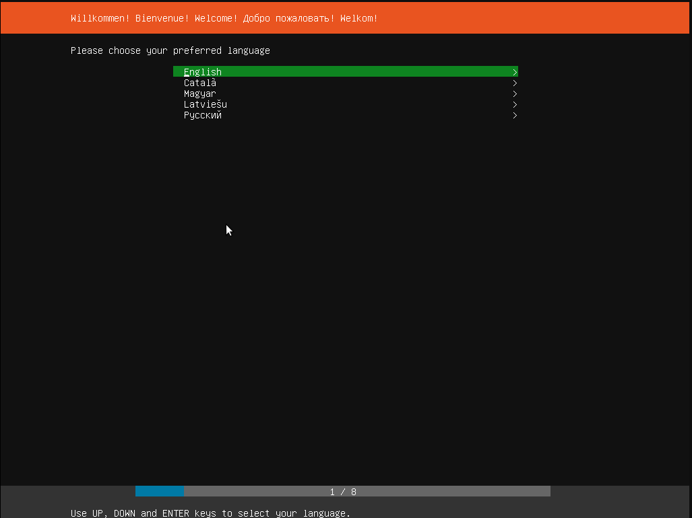

 

Crea un medio de instalación: Una vez que hayas descargado la imagen ISO, necesitarás crear un medio de instalación, como un USB booteable o un DVD. Si estás utilizando un USB, puedes utilizar herramientas como Rufus (para Windows) o Etcher (disponible para Windows, macOS y Linux) para crear el medio de instalación.

 

 

Configura la BIOS: Reinicia tu máquina y accede a la configuración de la BIOS. La forma de hacerlo varía según el fabricante, pero generalmente deberás presionar una tecla específica (como F2, F10 o Delete) durante el arranque. Asegúrate de configurar el orden de arranque para que tu máquina inicie desde el medio de instalación que creaste en el paso anterior (USB o DVD).

 

 

Inicia la instalación: Una vez que hayas configurado correctamente la BIOS, reinicia tu máquina nuevamente. Debería iniciarse desde el medio de instalación y aparecerá la pantalla de inicio de Ubuntu Server. Configura el idioma y la ubicación: El instalador de Ubuntu Server te pedirá que elijas el idioma y la distribución del teclado. Selecciona tus preferencias y haz clic en "Continue".

 

 

 

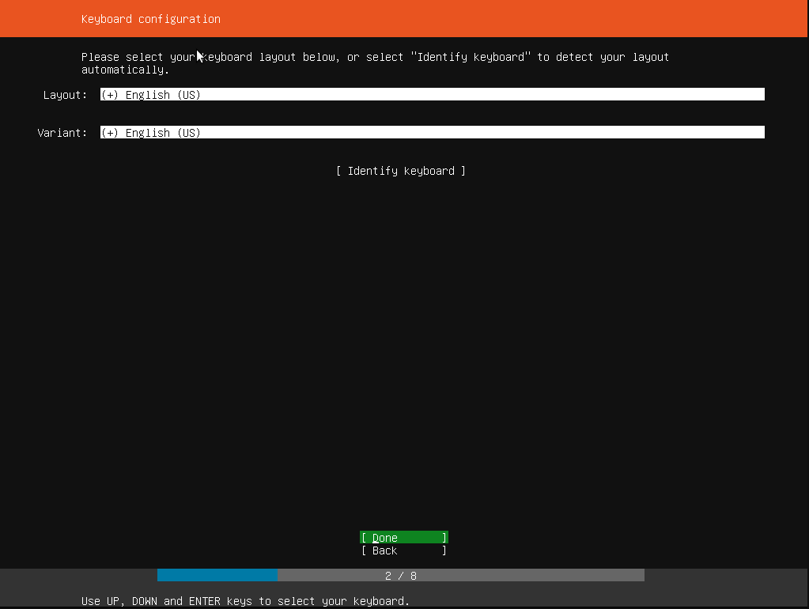

 

Ahora seleccionaremos el tipo de instalación dependiendo de para que vayamos a usar el ubuntu server :

 

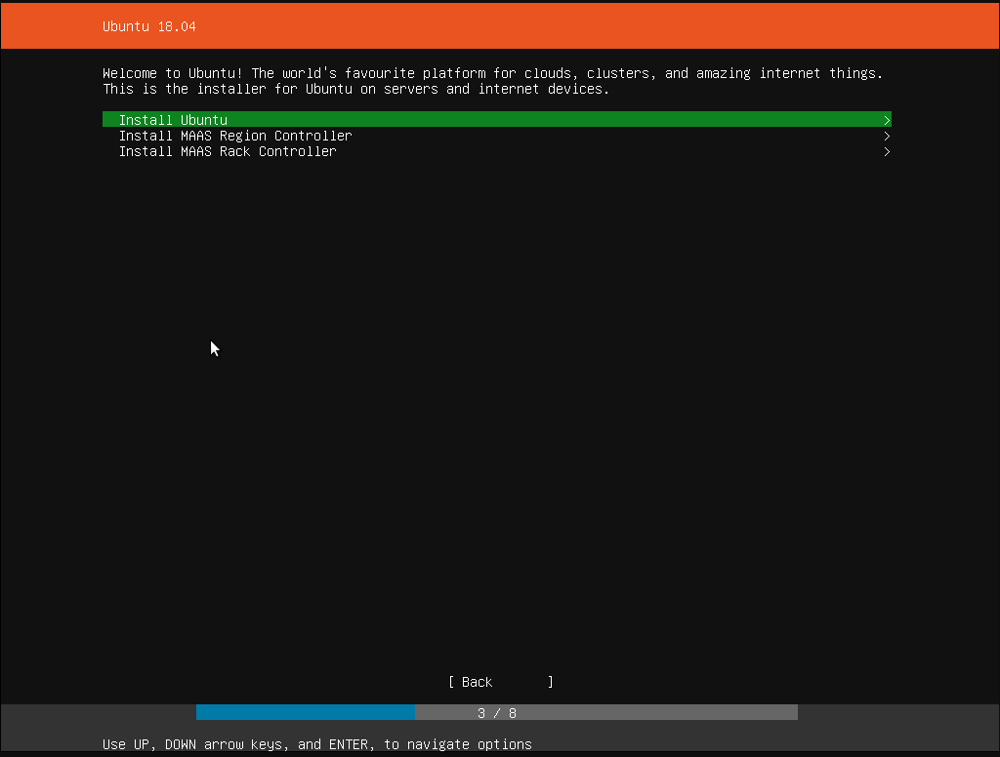

 

> MAAS significa "Metal como servicio", un servicio que trata los servidores físicos como máquinas virtuales (instancias) en la nube.    No hay necesidad de administrar los servidores individualmente: MAAS convierte el hardware en un recurso elástico similar a la nube. Registra e implementa sistemas operativos estándar o personalizados en hardware y máquinas virtuales de forma remota. Supervisa, administra y asegura fácil y eficientemente tu infraestructura de hardware.

 

Configura la conexión de red: A continuación, el instalador te pedirá que configures la conexión de red. Esto incluye la configuración de la dirección IP, la máscara de red, la puerta de enlace y los servidores DNS. Puedes optar por configurar manualmente o utilizar el DHCP para obtener automáticamente la configuración de red.

 

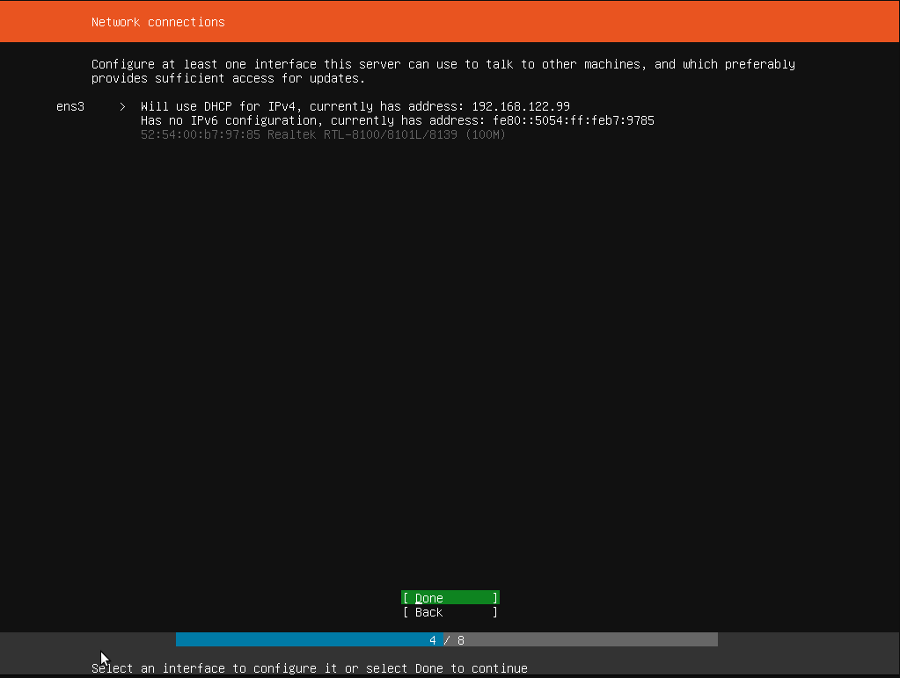

 

Configura el disco duro: El instalador te pedirá que configures el disco duro en el que deseas instalar Ubuntu Server. Puedes optar por borrar todo el disco y realizar una instalación limpia, o puedes optar por instalar Ubuntu Server junto con otro sistema operativo que ya tengas instalado en tu máquina. Si optas por la segunda opción, se te pedirá que ajustes el tamaño de las particiones.

 

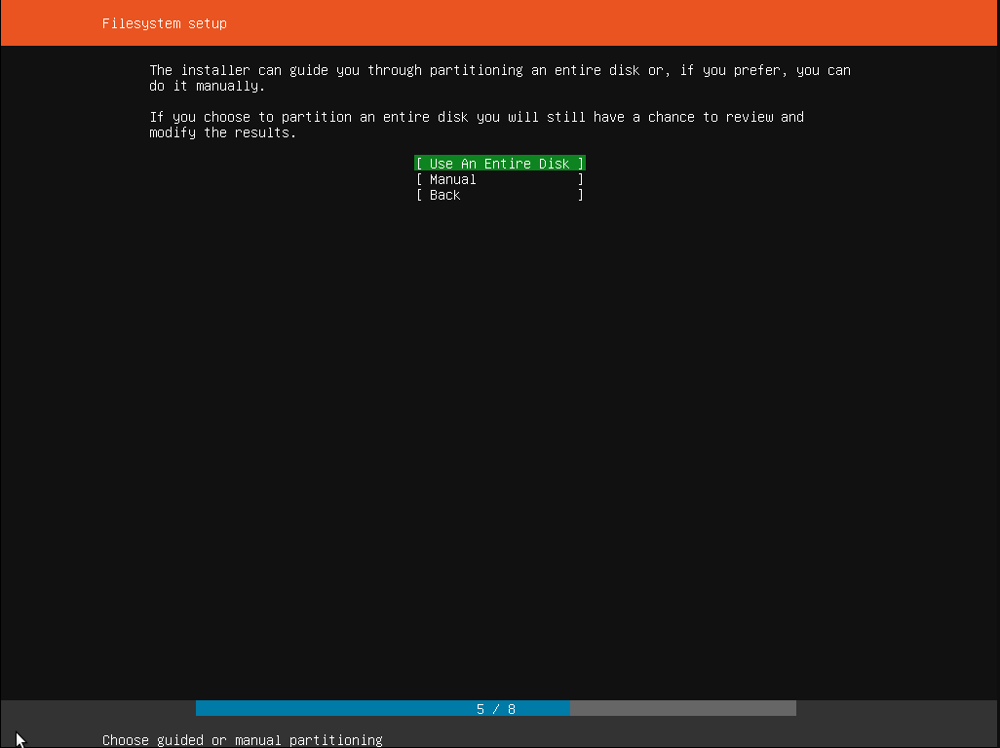

 

 

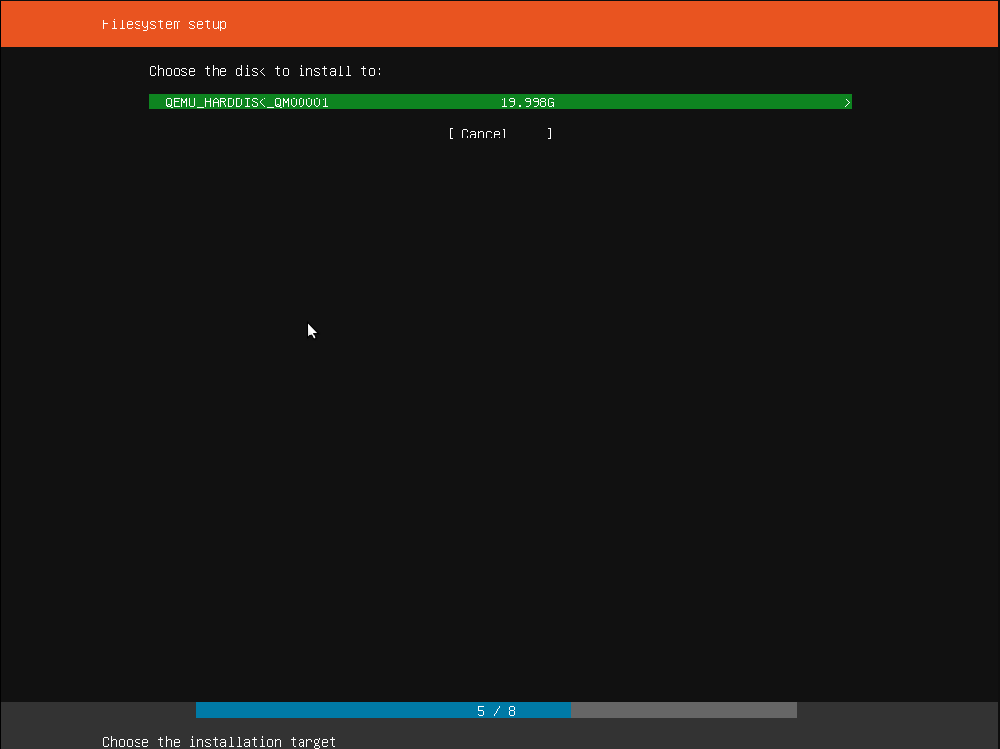

 

 

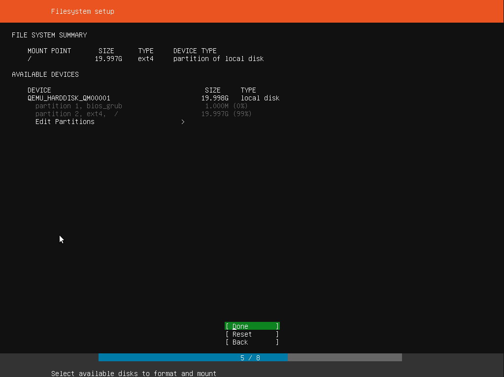

 

 

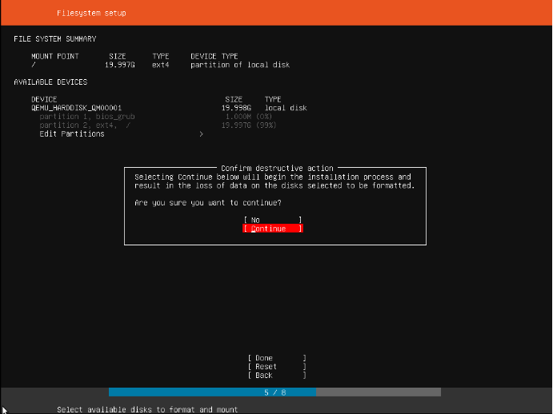

 

Configura la cuenta de usuario: El instalador te pedirá que crees una cuenta de usuario para acceder a Ubuntu Server. Ingresa tu nombre completo, nombre de usuario, contraseña y otros detalles de la cuenta.

 

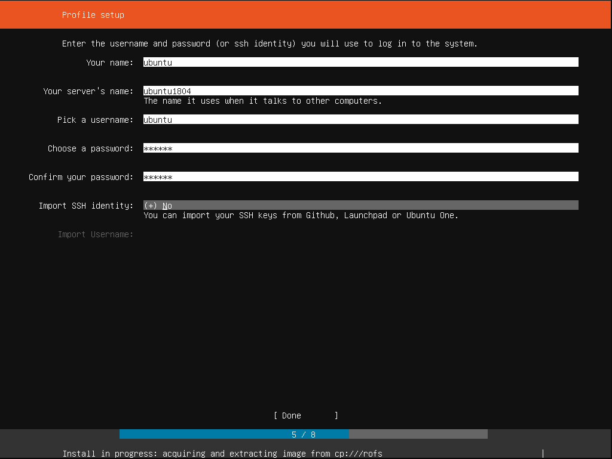

 

Espera a que termine la instalación: Una vez que hayas hecho todas las configuraciones necesarias, haz clic en "Install" y espera a que se complete el proceso de instalación. Esto puede tomar algunos minutos.

 

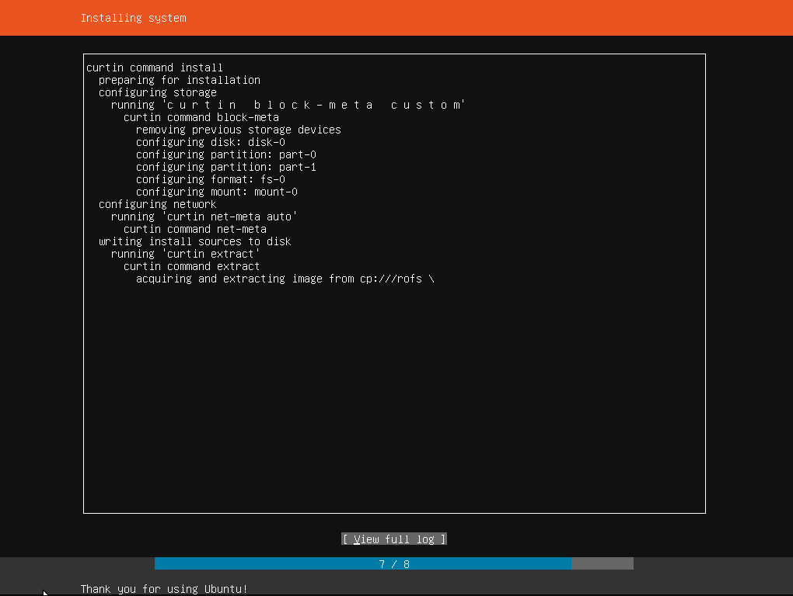

 

Reinicia y comienza a usar Ubuntu Server: Una vez que se complete la instalación, el instalador te pedirá que reinicies la máquina. Después de reiniciar, podrás acceder a Ubuntu Server y comenzar a usarlo.

 

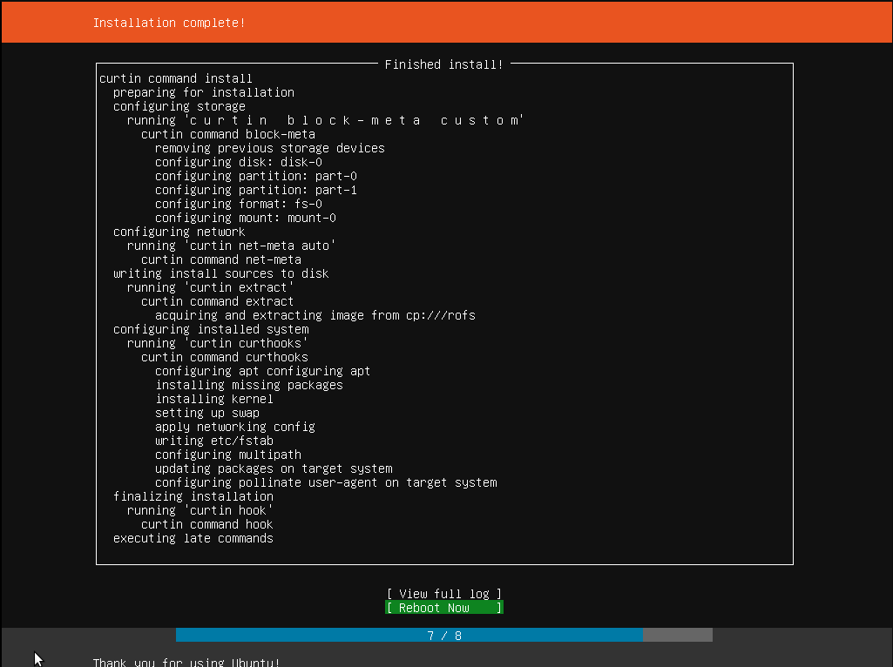

 