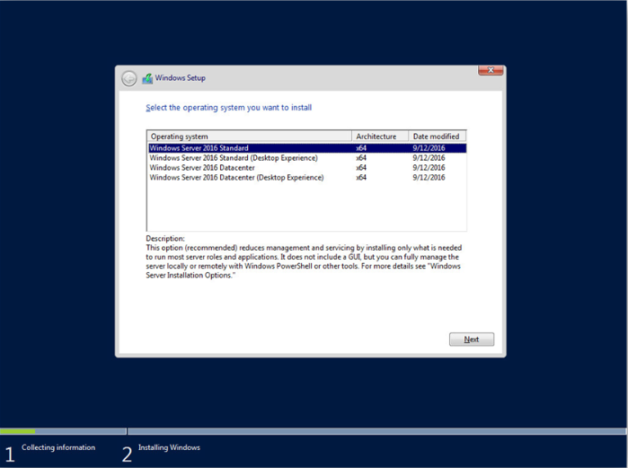

# Instalación de sistema operativo Windows Server 2016

***Nombre: Gabriel Contreras Quiroga***

 

 

Descarga la imagen ISO de Windows Server 2016: Dirígete al sitio web oficial de Microsoft y descarga la imagen ISO de Windows Server 2016. Asegúrate de descargar la versión correcta según la arquitectura de tu máquina (32 bits o 64 bits).

 

 

Crea un medio de instalación: Una vez que hayas descargado la imagen ISO, necesitarás crear un medio de instalación, como un USB booteable o un DVD. Si estás utilizando un USB, puedes utilizar herramientas como Rufus (para Windows) o Etcher (disponible para Windows, macOS y Linux) para crear el medio de instalación.

 

 

> La imagen es una demostración de como funciona el programa Etcher. 

 

Configura la BIOS: Reinicia tu máquina y accede a la configuración de la BIOS. La forma de hacerlo varía según el fabricante, pero generalmente deberás presionar una tecla específica (como F2, F10 o Delete) durante el arranque. Asegúrate de configurar el orden de arranque para que tu máquina inicie desde el medio de instalación que creaste en el paso anterior (USB o DVD).

 

 

Inicia la instalación: Una vez que hayas configurado correctamente la BIOS, reinicia tu máquina nuevamente. Debería iniciarse desde el medio de instalación y aparecerá la pantalla de inicio de Windows Server 2016 donde elegiremos el idioma, tiempo y ubicación, así como la distribución del teclado. 

 

 

Seleccionamos "Install Now" :

 

 

A continuación, nos pedirá la versión de Windows Server 2016 que queremos instalar. Por defecto nos pedirá instalar la versión server Core, sin entorno gráfico. Yo voy a instalar la versión con GUI, es decir, entorno gráfico y escritorio.

 

 

Acepta los términos de la licencia: Lee los términos de la licencia de Windows Server 2016 y marca la casilla "I accept the license terms" si estás de acuerdo con ellos. Haz clic en "Next" para continuar.

 

 

Selecciona el tipo de instalación: Puedes elegir entre una instalación "Custom" o "Upgrade". La instalación "Custom" realiza una instalación limpia de Windows Server 2016, mientras que la opción "Upgrade" actualiza una versión anterior de Windows Server. Selecciona la opción que mejor se adapte a tus necesidades y haz clic en "Next".

 

 

Selecciona la ubicación de instalación: Selecciona el disco duro en el que deseas instalar Windows Server 2016. Si deseas realizar una instalación limpia, selecciona la opción "Drive options (advanced)" y borra todas las particiones existentes. Luego, haz clic en "New" para crear una partición en el disco duro y especificar el tamaño que deseas asignarle. Haz clic en "Apply" para guardar los cambios.

 

 

Espera a que termine la instalación: Una vez que hayas hecho todas las configuraciones necesarias, haz clic en "Install" y espera a que se complete el proceso de instalación. Esto puede tomar algunos minutos.

 

 

 

 

Configura la contraseña de administrador: Una vez que se complete la instalación, se te pedirá que configures la contraseña de la cuenta de administrador. Ingresa la contraseña que deseas utilizar y haz clic en "Finish" para completar la instalación.

 

 